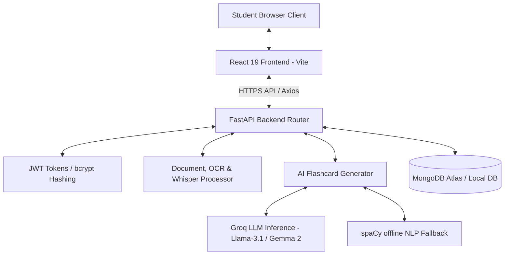
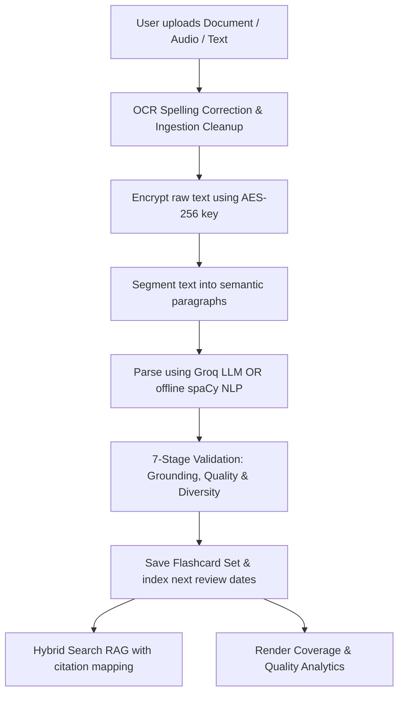

# SmartFlash AI

<div align="center">
  

  <h3>Privacy-First AI Study Assistant & Spaced Repetition Engine</h3>
  <p>Accelerate your active recall learning using ultra-fast Groq LLM inference, local NLP processing, and secure spaced repetition.</p>

  <p>
    
    
    
    
    
    
    
    
    
  </p>
</div>

---

## Overview

**SmartFlash AI** is a complete, production-grade study assistant designed to maximize student recall and deck building efficiency. By pasting study notes or uploading course materials (documents, slide decks, images, or voice notes), SmartFlash leverages advanced natural language processing (NLP) to extract concepts and synthesize high-yield review decks in real time. 

### Core Product Philosophy:
*   **Complete AI Learning Ecosystem**: Transition from simple flashcards to a full-scale AI Tutor with Summaries, Quizzes, Mind Maps, and RAG Chat.
*   **Structured Active Recall**: Supports multiple study card outputs including Q&A, Multiple Choice (MCQs), and Fill-in-the-Blank Cloze deletions.
*   **Adaptive Scheduling**: Automatically customizes review queues based on individual memory retention using the SM-2 Spaced Repetition algorithm.
*   **Premium SaaS Workspace**: A polished, fluidly resizable desktop and mobile Sidebar UI inspired by tier-1 production applications.
*   **Hybrid AI Generation**: Harnesses high-performance **Groq API Cloud Inference** for complex reasoning and schema compliance, with an offline **spaCy rule-based NLP pipeline** fallback when internet access is unavailable.
*   **Security & Encryption**: Documents and personal study notes are stored securely using industry-standard AES encryption keys, ensuring absolute data privacy.

---

## Features

### Authentication
*   **Secure Registration & Login**: Multi-stage validation using password hashing via `bcrypt`.
*   **JWT & Refresh Token Rotation**: Implements dual JWT setups (short-lived access tokens, long-lived rotating refresh tokens stored in MongoDB) with automatic session invalidation upon token-reuse detection.
*   **Protected Route Architecture**: Client-side navigation guards alongside server-side FastAPI dependency verification (`Depends(get_current_user)`).

### AI Document Processing & Ingestion
*   **Rich Format Ingestion**: Accepts PDF, DOCX, TXT, PPTX slide decks, image uploads (OCR via cloud/local processors), and audio files (Whisper speech-to-text transcribing voice notes).
*   **Extraction & Ingestion Cleaning**: Prior to chunking, documents undergo header/footer extraction, duplicate paragraph filtration, OCR spelling correction, and automatic language detection to guarantee clean input text.
*   **Semantic Chunking & AES Encryption**: Parses document structure, encrypts raw content with AES-256-GCM at rest, and splits context into semantic chunks for rapid retrieval.

### AI Flashcard Generation & Verification
*   **Multi-Format Decks**: Outputs Definitions, QA Cards, Multiple Choice options (MCQs) with shuffled distractors, Cloze fill-ups, Bloom's Taxonomy-based QA, and Scenario/Assertion-Reason layouts.
*   **7-Stage Validation Pipeline**: Fully validates generated cards by scoring concept relevance, detecting duplication, running grammatical reviews, and verifying strict grounding against the source text to prevent LLM hallucinations.
*   **Offline spaCy Fallback**: Local NLP parse rules take over if the cloud LLM is rate-limited or offline (utilizing entity detection, copulas, and sentence dependencies).

### Smart Review Queue (SM-2)
*   **SM-2 Spaced Repetition**: Tracks Ease Factor, interval progression, and repetition counts.
*   **Review Forecasts**: Provides a 30-day forecast chart predicting upcoming daily review volume.
*   **Leech Alert Detection**: Flags difficult terms with high fail/lapse ratios for custom study sessions.
*   **Interactive Study Player**: Feature-rich study screen supporting keyboard shortcuts, card flipping, progress bars, and custom audio speech playback.

### Comprehensive AI Tools
*   **AI Tutor (RAG Chat)**: Ask questions directly against your uploaded documents. The AI provides cited, grounded answers to prevent hallucinations.
*   **Smart Summaries**: Automatically generate Executive Summaries, Key Concept glossaries, and FAQs from long-form notes.
*   **AI Quizzes**: Generate and take dynamic MCQs, True/False, and Fill-in-the-blank assessments graded instantly by the LLM.
*   **Mind Maps & Planners**: Visualize concept relationships in your material and generate personalized day-by-day study schedules.

### Workspace Dashboard & Quality Analytics
*   **Premium SaaS UI**: Fully resizable Sidebar navigation featuring glassmorphism, responsive mobile drawers, and seamless Light/Dark mode transitions.
*   **Mastery Heatmaps & Timelines**: High-impact SVG visualisations tracking streaks, review volume, and historical retention metrics.
*   **AI Document Intelligence Panel**: Computes and displays Document Coverage %, Concept Mapping %, Question Diversity %, Grounding Accuracy %, Duplicate Rates, and Hallucination metrics.
*   **Document File Center**: A complete document manager panel enabling direct file uploads, database reference deletions, and single-click generation redirection.

---

## Architecture

SmartFlash AI operates on a modern multi-tier decoupled architecture:



---

## AI Document Intelligence Pipeline

SmartFlash processes study material through a 7-stage data refining pipeline:



1.  **Ingestion & Parsing**: Extracted file bytes are converted to clean strings. OCR is performed on image inputs, and audio notes are transcribed using Groq Whisper.
2.  **Ingestion Cleanup**: Automatic header/footer removal, duplicate paragraph filtration, OCR correction, and language detection.
3.  **AES Shielding**: Raw strings are secured with AES-256 before writing to database fields.
4.  **Semantic Chunking**: Large texts are split into contextual chunks.
5.  **Generative Extraction**: Groq constructs cards according to difficulty constraints, model configurations, and preset prompts.
6.  **7-Stage Validation Pipeline**: Validates against duplicate generation, schema structures, grammatical rules, educational score mapping, and strict grounding verification (canceling ungrounded/hallucinated outputs).
7.  **Hybrid RAG Retrieval**: Integrates vector similarity search + keyword matching density + boosted exact match re-ranking, exposing citations with reliability confidence scoring:
    *   **95-100%**: Highly Reliable
    *   **80-94%**: Reliable
    *   **60-79%**: Moderate Confidence
    *   **<60%**: Low / Warnings flagged

---

## Technology Stack

| Category | Technology | Purpose |
| :--- | :--- | :--- |
| **Frontend** | React 19, Vite 8, React Router DOM v7 | Single Page Application framework and routing engine |
| **Styling & UI** | Tailwind CSS v4, Lucide Icons, Custom 3D CSS | Glassmorphism dashboard designs, icons, and card flips |
| **Backend** | Python 3.11+, FastAPI, Uvicorn | High-performance asynchronous API framework |
| **Database** | MongoDB Atlas, Motor client | Asynchronous document storage for user profiles and decks |
| **Authentication** | PyJWT, Passlib (bcrypt) | Secure session management, password hashing, token rotation |
| **AI Inference** | Groq Python SDK (Llama 3.1 8B, Gemma 2 9B) | Structured LLM flashcard generation & AI tutoring |
| **Audio Transcription** | Groq Whisper (API) | Audio note transcription |
| **Offline NLP** | spaCy (`en_core_web_sm`) | Offline backup generator |
| **Security Vault** | Cryptography (Fernet) | AES-256 encryption for user notes |
| **Containerization** | Docker, Docker Compose | Development and production container hosting |

---

## Folder Structure

```text
flashcard-generation/
├── backend/
│   ├── models/             # Pydantic schemas (User, Flashcard, Settings)
│   ├── routes/             # FastAPI controllers (Auth, Documents, Flashcards, Settings, Study Assistant)
│   ├── services/           # Business layer (Groq, RAG, spaCy NLP, Embeddings, Encryption, Rate Limiter)
│   ├── tests/              # Pytest backend API & NLP rule suites
│   ├── .env.example        # Environment variable template
│   ├── database.py         # Async MongoDB engine & client wrapper
│   ├── auth.py             # Security dependencies & token signers
│   ├── download_model.py   # spaCy model downloader helper
│   ├── requirements.txt    # Python backend package dependencies
│   ├── Dockerfile          # Backend Docker environment
│   └── main.py             # Application startup entrypoint
├── frontend/
│   ├── src/
│   │   ├── components/     # Reusable layout cards, resizable SaaS Sidebar, loading buttons
│   │   ├── pages/          # Pages (Dashboard, DocumentLibrary, StudyAssistant, Summary, Quiz, MindMap, Planner, Analytics, CreateCards, Review, History, Settings)
│   │   ├── services/       # Axios API client routing configurations
│   │   ├── App.jsx         # React routing configurations
│   │   ├── index.css       # Tailwind entrypoint + core custom css variables
│   │   └── main.jsx        # Client render hook
│   ├── index.html          # HTML Shell with SEO parameters
│   ├── postcss.config.js   # PostCSS configuration file
│   ├── tailwind.config.js  # Tailwind CSS theme configurations
│   ├── nginx.conf          # Nginx production configuration
│   └── Dockerfile          # Frontend production build environment
└── docker-compose.yml      # Multi-container orchestration configurations
```

---

## Installation & Setup

### Prerequisites
*   **Python 3.11+** installed locally.
*   **Node.js v18+** & `npm` package manager.
*   A running **MongoDB** database instance (Atlas or local).

### 1. Backend Setup

1.  **Initialize Virtual Environment**:
    ```bash
    python -m venv venv
    ```
2.  **Activate Virtual Environment**:
    *   **Windows (PowerShell)**: `.\venv\Scripts\Activate.ps1`
    *   **macOS / Linux**: `source venv/bin/activate`
3.  **Install dependencies**:
    ```bash
    cd backend
    pip install -r requirements.txt
    ```
4.  **Download Spacy NLP Model**:
    ```bash
    python download_model.py
    ```
5.  **Configure environment variables**:
    Copy `.env.example` to `.env` and fill in the required keys:
    ```bash
    cp .env.example .env
    ```
    *(See the environment variable table below for reference).*
6.  **Run backend server**:
    ```bash
    uvicorn main:app --reload --host 127.0.0.1 --port 8000
    ```

### 2. Frontend Setup

1.  **Navigate to directory & Install npm packages**:
    ```bash
    cd ../frontend
    npm install
    ```
2.  **Run Dev Server**:
    ```bash
    npm run dev
    ```
    Open [http://localhost:5173](http://localhost:5173) in your browser.

### 3. Containerized Setup (Docker Compose)
Launch both services and database links inside containers in one command:
```bash
docker-compose up --build
```
*   **Web Client URL**: [http://localhost:3000](http://localhost:3000)
*   **REST Server URL**: [http://localhost:8000](http://localhost:8000)

---

## Environment Variables

The backend application requires a `.env` file in the `backend/` directory with the following variables:

| Variable | Description | Example / Default |
| :--- | :--- | :--- |
| `MONGO_URI` | MongoDB Connection String | `mongodb://localhost:27017/smartflash` |
| `JWT_SECRET` | Secret key used to sign JWT Access tokens | `generate_with_openssl_rand_hex_32` |
| `GROQ_API_KEY` | Groq Cloud API access key | `gsk_xxxx...` |
| `ENCRYPTION_KEY` | Fernet key (AES-256) used for document texts | `generate_using_cryptography_Fernet_generate_key` |
| `ACCESS_TOKEN_EXPIRE_MINUTES` | Access token duration | `1440` (24 hours) |

---

## API Documentation

### Authentication APIs
| Method | Route | Description | Auth Required |
| :--- | :--- | :--- | :--- |
| `POST` | `/api/register` | Register new student profile | No |
| `POST` | `/api/login` | Authenticate credentials & return tokens | No |
| `POST` | `/api/auth/refresh` | Rotate expired sessions using refresh token | No |
| `POST` | `/api/auth/logout` | Revoke active refresh token | Yes |
| `GET` | `/api/me` | Fetch active user credentials | Yes |

### Flashcard APIs
| Method | Route | Description | Auth Required |
| :--- | :--- | :--- | :--- |
| `POST` | `/api/flashcards/generate` | Build new study sets from source | Yes |
| `GET` | `/api/flashcards` | List all user study sets | Yes |
| `PUT` | `/api/flashcards/set/{set_id}` | Rename a study set | Yes |
| `DELETE` | `/api/flashcards/set/{set_id}` | Delete entire set and associated cards | Yes |
| `POST` | `/api/flashcards/set/{set_id}/card` | Add a manual flashcard to a set | Yes |
| `PUT` | `/api/flashcards/set/{set_id}/card/{card_id}` | Edit an existing card | Yes |
| `DELETE` | `/api/flashcards/set/{set_id}/card/{card_id}` | Delete a card from a set | Yes |

### Document & Upload APIs
| Method | Route | Description | Auth Required |
| :--- | :--- | :--- | :--- |
| `POST` | `/api/documents/upload` | Upload & process text/PDF/DOCX/PPTX/Audio/Image | Yes |
| `GET` | `/api/documents` | List all uploaded documents | Yes |
| `DELETE` | `/api/documents/{doc_id}` | Remove document references and vault text | Yes |

### Spaced Repetition Review APIs
| Method | Route | Description | Auth Required |
| :--- | :--- | :--- | :--- |
| `GET` | `/api/review` | Retrieve due cards for today (cap-limited) | Yes |
| `POST` | `/api/review/sm2-update` | Submit 0-5 quality score to update SM-2 metrics | Yes |
| `POST` | `/api/review/update` | Legacy known/not_known update endpoint | Yes |
| `GET` | `/api/forecast` | Retrieve daily review forecasts for 30 days | Yes |
| `GET` | `/api/leech` | Retrieve flagged low ease-factor cards | Yes |

### AI Study Assistant & Tutor APIs
| Method | Route | Description | Auth Required |
| :--- | :--- | :--- | :--- |
| `POST` | `/api/upload` | KB ingestion alias route | Yes |
| `POST` | `/api/chat` | Chat with single or all documents (RAG) | Yes |
| `POST` | `/api/search` | Search semantic chunks of documents | Yes |
| `GET` | `/api/summary` | Fetch document summary content | Yes |
| `POST` | `/api/quiz` | Generate customized interactive quizzes | Yes |
| `POST` | `/api/quiz/submit` | Evaluate quiz answers and return score card | Yes |
| `POST` | `/api/ai-tutor` | AI Tutor explanations with analogies & tricks | Yes |
| `POST` | `/api/knowledge-graph` | Generate interactive concept relationship graphs | Yes |

---

## AI Models & Fallback

SmartFlash prioritizes reliability through its dual-inference pipeline:

1.  **Groq Cloud (Default)**: Utilizes ultra-fast open-weights models to parse text chunks and format structured outputs (using JSON schemas):
    *   **Llama 3.1 8B (`llama-3.1-8b-instant`)**: High-speed generator.
    *   **Gemma 2 9B (`gemma-2-9b-it`)**: High precision for conceptual topics.
    *   **Mixtral 8x7B (`mixtral-8x7b-32768`)**: Complex logical breakdowns.
2.  **spaCy NLP (Fallback)**: When offline or out of API credits, a Python rule-based generator takes over using the local `en_core_web_sm` pipeline. It parses grammar structures and entities to form flashcards.
3.  **Validation Pipeline**: All generated outputs undergo duplicate checks, schema validation, and text cleanup before storage.

---

## Spaced Repetition (SM-2)

The review engine implements the **SuperMemo-2 (SM-2)** algorithm. When a student evaluates a card, they submit a quality score $q$ from $0$ to $5$:
*   **5**: Perfect response.
*   **4**: Correct response after hesitation.
*   **3**: Correct response with serious difficulty.
*   **2**: Incorrect response; where the correct one seemed easy to recall.
*   **1**: Incorrect response; the correct one remembered.
*   **0**: Complete blackout.

### Algorithm Calculations:
1.  **Ease Factor ($EF$) Adjustment**:
    $$EF_{new} = EF_{old} + (0.1 - (5 - q) \cdot (0.08 + (5 - q) \cdot 0.02))$$
    *(Bounded by a minimum value of $1.3$ to prevent cards from being locked in a low-review state).*
2.  **Repetitions ($n$) and Review Interval ($I$)**:
    *   If $q < 3$, card is marked as incorrect:
        $$n = 0$$
        $$I = 1\text{ day}$$
    *   If $q \ge 3$, card is marked as correct:
        *   For $n = 0$: $I = 1\text{ day}$
        *   For $n = 1$: $I = 6\text{ days}$
        *   For $n > 1$: $I_{new} = \text{round}(I_{old} \cdot EF)$
        *   Increment repetition counter: $n = n + 1$
3.  **Next Review Date**:
    $$\text{Next Review} = \text{Current Date} + I\text{ days}$$

---

## Screenshots Placeholder

*   **Premium Dashboard**: ``
*   **Document Library**: ``
*   **AI Tutor**: ``
*   **Smart Summaries**: ``
*   **AI Quizzes**: ``
*   **Spaced Repetition Player**: ``
*   **System Settings**: ``

---

## Performance & Security

### Performance Optimization
*   **Lazy Loading**: Components are loaded dynamically to decrease initial bundle size.
*   **Asynchronous Processing**: Python FastAPI uses asynchronous routes for non-blocking I/O operations (e.g. database querying via Motor).
*   **MongoDB Indexing**: Indexes are created on user IDs and next review dates to optimize query execution times.

### Security Implementation
*   **AES Encryption Vault**: Document text strings are encrypted using AES-256-GCM.
*   **Secure Password Storage**: Passwords are hashed using `bcrypt` before database storage.
*   **Limiter Shielding**: Endpoints are protected against DDoS and brute force attacks using `SlowAPI` rate-limiting policies.

---

## Testing

Ensure code reliability and verify NLP parsing logic using the test suite:
```bash
# Run pytest test suite
cd backend
python -m pytest tests/
```
*   **Unit Tests**: Validate individual card parsing patterns and SM-2 formula returns.
*   **Integration Tests**: Mock token registration and verify endpoint authorizations.

---

## Future Scope

*   **Offline Sync Client**: Implement indexedDB client-side syncing to allow offline flashcard reviews.
*   **Collaborative Decks**: Group study sharing allowing classmates to exchange study materials.
*   **Voice Recall Grading**: Integrate microphone evaluation to analyze and grade voice answers during reviews.
*   **Anki Plugin Sync**: Sync flashcards directly with local Anki desktop libraries.

---

## License

Distributed under the MIT License. See `LICENSE` for more information.

---

## Author

**Student Developer / Contributor**
*   **GitHub**: [github.com/sanjaikumarkaleeswaran](https://github.com/sanjaikumarkaleeswaran)
*   **LinkedIn**: [linkedin](https://www.linkedin.com/in/sanjaikumar-kaleeswaran/)
*   **Portfolio**: [live view](https://smartflash-frontend.onrender.com/)
