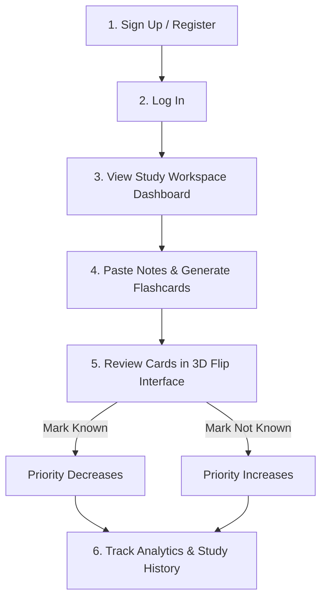

# SmartFlash: User Study Workflow Guide

This document outlines the step-by-step workflow a student follows to register, generate AI flashcards, and master study topics using SmartFlash's spaced repetition study queue.

---

## 🗺️ High-Level User Journey

---

## 📥 Detailed Step-by-Step Workflow

### Step 1: Secure Account Creation & Entry
1. **Open the App**: Navigate to `http://localhost:5173`. You will be greeted by the landing page explaining the local NLP approach.
2. **Create Account**: Click **Sign Up** in the top right. Enter your email address and choose a password (minimum 6 characters).
3. **Log In**: After successful registration, you will be redirected to the **Log In** page. Enter your credentials to establish a secure authenticated session.

---

### Step 2: Navigate the Workspace Dashboard
Upon logging in, you arrive at the **Study Workspace Dashboard**:
* **Mastery Circular Gauge**: Displays the percentage of flashcards you have successfully committed to memory (marked as "Known").
* **Workspace Metrics**: Displays quick summaries of:
  * *Total Sets*: Number of topics generated.
  * *Total Cards*: Total pool of questions.
  * *Needs Practice*: Number of cards marked "Not Known" currently waiting in your priority queue.
* **Recent Study Sets**: Quick cards showing your last three study notes.
* **Review Queue Button**: Instantly starts a study session of all cards waiting for review.

---

### Step 3: Paste Notes & Generate Flashcards
1. Click **Generate Cards** (or navigate to `/create` via the navbar).
2. **Input Study Notes**: In the text area, paste text from your textbooks, lecture notes, or research papers.
   * *Requirement*: The text must be at least 30 characters long and composed of full, factual sentences for optimal parsing.
3. **Trigger AI Generation**: Click **Generate Flashcards**.
4. **AI Pipeline Processing**: The UI will lock and display real-time updates as our local backend parser scans your text:
   1. *Tokenizing & POS tagging* (mapping nouns, verbs, and syntax structures).
   2. *Named Entity Recognition (NER)* (isolating locations, dates, and people).
   3. *Dependency matching rules* (formulating definition, chronological, and geographic questions).
   4. *Database indexing* (saving the set to MongoDB).
5. **View Results**: The page will render the new set's name, a count of extracted cards, and list the generated **Questions** and **Answers** side-by-side.
6. Click **Start Reviewing Now** to begin studying this set.

---

### Step 4: Study with the Interactive 3D Review Queue
When reviewing (via the `Review Queue` or by launching a specific set from the dashboard/history):
1. **Examine the Front Card**: You are presented with a premium flashcard displaying a **Question** and a difficulty tag (Easy/Medium/Hard) calculated from sentence complexity.
2. **Flip the Card**: Click anywhere on the card to trigger a smooth 3D flip animation showing the **Answer** on the reverse side. Click again to flip back.
3. **Grade Your Memory**:
   * If you struggled to recall the answer, click **Not Known**.
     * *Spaced Repetition Impact*: This adds `+2` to the card's priority weight, causing it to return to the front of the review queue faster.
   * If you successfully recalled the answer, click **Known**.
     * *Spaced Repetition Impact*: This subtracts `-1` from the card's priority weight (down to a floor of `0`), pushing it back so you see it less frequently.
4. **Complete Session**: Once all cards in the queue have been graded, a completion screen displays your session summary (number of cards marked Known vs. Practice).

---

### Step 5: Expand Study History
1. Navigate to **History** via the top navbar.
2. **Search Topics**: Use the search bar in the top-right to filter sets by title or keywords.
3. **Card Inspector Accordion**: Click **View Cards** on any past set to expand a detailed sheet containing:
   * The original source notes you pasted.
   * Every card in the set, showing its question, answer, difficulty, review count, and current spaced repetition priority rating.
4. **Launch Focused Review**: Click **Study** on any historical set card to launch a study session focusing *only* on that specific topic.
