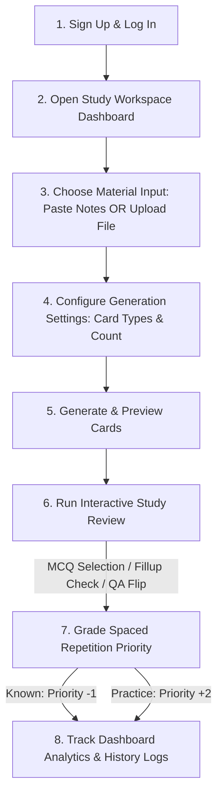

# SmartFlash: User Study Workflow Guide

This document outlines the step-by-step workflow a student follows to register, upload study materials, configure custom flashcards, study using interactive formats, and track learning analytics using SmartFlash's spaced repetition workspace.

---

## 🗺️ High-Level User Journey

---

## 📥 Detailed Step-by-Step Workflow

### Step 1: Secure Account Creation & Entry
1. **Open the App**: Navigate to `http://localhost:5173`. You will see the landing page detailing the local, offline NLP approach.
2. **Create Account**: Click **Sign Up** in the top right. Enter your email address and choose a password (minimum 6 characters).
3. **Log In**: After successful registration, enter your credentials on the **Log In** page to establish your secure session.

---

### Step 2: Manage the Study Workspace Dashboard
Upon logging in, you arrive at the **Study Workspace Dashboard** featuring real-time study analytics:
* **Metrics Cards**: Summarizes your learning progress:
  * *Total Sets*: The count of study topics you have organized.
  * *Total Cards*: The total size of your question pool.
  * *Documents Uploaded*: The count of PDF, DOCX, and TXT files parsed.
  * *Known Cards*: Total memorized questions and your overall mastery rate.
* **Learning Insights**: 
  * *Mastery Ring*: Circular progress gauge visualizing the percentage of cards mastered.
  * *Needs Review*: Count of cards requiring practice.
  * *Card Types Distribution*: Progress bars showing your mix of QA, MCQ, and Fillups cards.
* **Recent Study Sets**: A quick-launch list of your three most recently generated topics.
* **Review Queue Button**: Starts a global review session containing all priority items from all sets.

---

### Step 3: Input Materials & Configure Flashcards
1. Click **Generate Cards** (or navigate to `/create` via the top navigation bar).
2. **Choose Input Method**: Select one of the two tabs at the top of the form:
   * **Paste Notes**: Click to open a standard text area where you can paste textbook snippets, lecture notes, or web articles. Must be at least 30 characters.
   * **Upload Document**: Click to open the Drag-and-Drop file uploader. Drag a file from your file explorer or click to browse.
     * *Supported formats*: PDF (`.pdf`), Microsoft Word (`.docx`), or Plain Text (`.txt`).
     * *File limit*: Max 5MB size.
     * *Upload progress*: The card shows an animated progress bar as it uploads and extracts text.
3. **Generation Settings**: In the right-hand panel, customize your card configuration:
   * **Flashcard Type**:
     * *Question Answer*: Standard definitions, people, geographic locations, and chronological events.
     * *Fill in the Blank*: Sentences with key nouns hidden behind a `______` blank line.
     * *Multiple Choice*: Fact-based questions containing 4 options (1 correct answer and 3 relevant distractors).
   * **Number of Cards**: Select your count limit from the dropdown (**5**, **10**, **20**, **30**, or **50** flashcards).
4. **Trigger AI Generation**: Click **Generate AI Flashcards**.
5. **Pipeline Progress**: The page displays animated updates as the local spaCy NLP pipeline processes the text:
   * *Syntactic tagging & tokenization* -> *Named Entity Recognition* -> *Distractor/Mask generation* -> *Database indexing*.
6. **Result Preview**: View the generated cards in a grid.
   * If MCQs: Displays the correct answer highlighted in green among the 4 alternative options.
7. Click **Start Reviewing Now** to load the set into the review queue.

---

### Step 4: Study with the Interactive Review Queue
When reviewing, the study interface adapts to the card format:

#### Format A: Question Answer (QA)
1. You are presented with a 3D card displaying the question and difficulty score.
2. Click anywhere on the card to trigger a 3D flip animation revealing the answer on the back.
3. Click the grading buttons below the card.

#### Format B: Fill in the Blank (Cloze)
1. You are shown a question containing a blank line (`______`).
2. Type your guess in the text input box below the card and click **Check Answer**.
3. The card immediately displays a results banner showing whether you got it correct, your guess, and the exact answer.
4. The appropriate grading feedback button is highlighted for you.

#### Format C: Multiple Choice (MCQ)
1. You are shown a question and a grid of 4 options (labelled A, B, C, D).
2. Click on your option.
3. The selected option instantly lights up **green** (if correct) or **red** (if incorrect), while the correct option is highlighted in green.
4. The appropriate grading feedback button is highlighted for you.

#### Spaced Repetition Grading
No matter the card type, submit your rating to update the card's priority:
* **Not Known (+2 Priority)**: Weights the card heavier so it reappears sooner in your study sessions.
* **Known (-1 Priority)**: Decreases its frequency weight, pushing it to the back of the queue.

---

### Step 5: Search & Manage Study Collections (CRUD Operations)
1. Navigate to **History** in the top navbar.
2. **Search Topics**: Type in the top-right search box to filter sets by title, notes, source format, or card type.
3. **Rename Study Sets**: Click the Pencil/Edit icon next to a study set's title, type a new name in the text input, and click the green Checkmark button to save.
4. **Delete Entire Sets**: Click the Trashcan icon on the far right of any set row. A safety confirmation bar will appear; click **Confirm Delete** to permanently remove the set and all its cards from the database.
5. **Inspect Flashcards**: Click **View Cards** on any topic row to slide open the detail accordion.
6. **Add Custom Flashcards**: Click the **Add Flashcard** button inside the set cards header. Choose the card format (QA, Fillup, MCQ) and difficulty, input your prompt and correct answer (and write 4 choices if it is a Multiple Choice card), and click **Save Card** to append it.
7. **Edit Individual Cards**: Click the Pencil/Edit icon on any card's header. You can modify the question, correct answer, choice options, and difficulty level in-place. Click the green Checkmark button to save.
8. **Delete Specific Cards**: Click the Trashcan icon on any individual card's header, and click **Confirm Delete** to remove it from the set.
9. **Focused Review**: Click the blue **Study** button on the set row to launch a review session restricted *only* to that specific topic.
